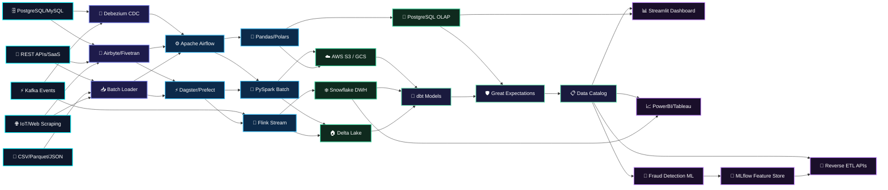

```markdown
<!-- ═══════════ HEADER ANIMATED WAVING BANNER ═══════════ -->
<div align="center">
  

  <!-- ANIMASI TYPING MULTI-LINE -->
  <a href="https://git.io/typing-svg">
    
  </a>

  <br/><br/>

  <h2>👨‍💻 VAN (vn002-tech)</h2>
  <p><b>Data Engineer & MLOps Specialist</b> | Python · PySpark · Airflow · dbt · PostgreSQL</p>

  <br/>

  <!-- SOCIAL BADGES ANIMATED HOVER -->
  <a href="https://github.com/vn002-tech">
    
  </a>
  <a href="https://linkedin.com/in/YOUR_LINKEDIN">
    
  </a>
  <a href="mailto:your_email@gmail.com">
    
  </a>
  <a href="https://kaggle.com">
    
  </a>

  <br/><br/>

  <!-- TECH MINI BADGE ROW (ANIMATED) -->
  
  
  
  
  
  
  
  

  <br/><br/>

  <!-- VISITOR COUNTER ANIMATED -->
  
</div>

<br/>

---

<!-- ═══════════ GITHUB STATS SECTION ═══════════ -->


<br/>

<div align="center">

  <!-- STATS + TOP LANGS SIDE BY SIDE -->
  
  

  <br/><br/>

  <!-- ANIMATED STREAK (API ALTERNATIVE) -->
  

  <br/><br/>

  <!-- GITHUB TROPHY ANIMATED -->
  

  <br/><br/>

  <!-- ACTIVITY GRAPH ANIMATED -->
  

</div>

<br/>

---

<!-- ═══════════ ABOUT ME SECTION ═══════════ -->


<br/>

```python
class DataEngineer:
    def __init__(self):
        self.username    = "vn002-tech"
        self.role        = "Data Engineer & MLOps Specialist"
        self.location    = "Indonesia 🇮🇩"
        self.focus_areas = [
            "Enterprise ETL/ELT Pipeline Orchestration",
            "Real-Time Stream Processing & CDC",
            "Cloud Data Lakehouse Architecture",
            "Fraud Detection & Anomaly Systems"
        ]
        self.current_stack = [
            "PySpark", "Apache Airflow", "dbt",
            "PostgreSQL", "Kafka", "Snowflake", "Streamlit"
        ]
        self.learning_now = ["Apache Flink", "Databricks", "Terraform"]

    def get_mission(self) -> str:
        return (
            "Building robust, scalable data pipelines to transform "
            "high-volume transactional data into actionable insights."
        )

if __name__ == "__main__":
    engineer = DataEngineer()
    print(f"🚀 Mission: {engineer.get_mission()}")
    print(f"📚 Currently Learning: {engineer.learning_now}")
```

<br/>

---

<!-- ═══════════ TECH STACK SECTION ═══════════ -->


<br/>

<div align="center">

  <h3>⚙️ Languages & Query Engines</h3>
  

  <h3>🔥 Big Data, ETL & Orchestration</h3>
  
  <p><i>PySpark · Apache Airflow · Apache Flink · dbt · Great Expectations</i></p>

  <h3>☁️ Cloud, Infrastructure & DevOps</h3>
  

  <h3>📊 Visualization & ML Serving</h3>
  
  <p><i>Streamlit · PowerBI · MLflow · Scikit-Learn · XGBoost · LightGBM</i></p>

  <br/>

  <!-- ANIMATED SKILL PROGRESS BARS AS BADGES -->
  
  
  
  

</div>

<br/>

---

<!-- ═══════════ DATA MESH ARCHITECTURE ═══════════ -->


<br/>



<br/>

---

<!-- ═══════════ FEATURED PROJECTS ═══════════ -->


<br/>

| 🔖 Project | ⚙️ Stack | 📝 Description |
| :--- | :--- | :--- |
| 🛡️ **[Bank Fraud Detection System](https://github.com/vn002-tech/Transaksi_bank)** | `Python` `XGBoost` `Streamlit` `PostgreSQL` | End-to-end ML pipeline with real-time anomaly detection dashboard. |
| ⚡ **[Real-Time Streaming Ingestion](https://github.com/vn002-tech)** | `PySpark` `Kafka` `PostgreSQL` | High-throughput streaming data pipeline for financial transaction logs. |
| ☁️ **[Automated ETL Orchestration](https://github.com/vn002-tech)** | `Airflow` `dbt` `Snowflake` | End-to-end data transformation & modern data warehousing pipeline. |
| 🔍 **[Data Quality Framework](https://github.com/vn002-tech)** | `Great Expectations` `dbt` `Python` | Automated data validation & quality monitoring across pipeline layers. |

<br/>

---

<!-- ═══════════ FOOTER ANIMATED WAVE ═══════════ -->
<div align="center">

  <!-- ANIMATED SNAKE CONTRIBUTION GRAPH -->
  <picture>
    <source media="(prefers-color-scheme: dark)" srcset="https://raw.githubusercontent.com/vn002-tech/vn002-tech/output/github-contribution-grid-snake-dark.svg" />
    <source media="(prefers-color-scheme: light)" srcset="https://raw.githubusercontent.com/vn002-tech/vn002-tech/output/github-contribution-grid-snake.svg" />
    
  </picture>

  <br/>

  

  <br/><br/>

  <sub><i>"In God we trust, all others must bring data." — W. Edwards Deming</i></sub>

  <br/><br/>

  

</div>
```
