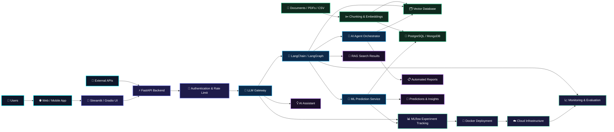

  

   

  

    

  <h2>👨‍💻 VAN (vn002-tech)</h2>
  
<b>AI Engineer & MLOps Enthusiast</b> | Python · Machine Learning · LLMs · RAG · FastAPI

   

  
  
  

    

  
  
  
  
  
  
  
  

    

  

 

---

 

  

  

    

  

    

  

    

  

 

---

 

| 🔑 Key | 💡 Value |
|:---|:---|
| 👤 **Username** | `vn002-tech` |
| 💼 **Role** | AI Engineer & MLOps Enthusiast |
| 📍 **Location** | Indonesia 🇮🇩 |
| 🎯 **Focus** | LLM Applications · RAG Systems · AI Agents · Machine Learning |
| 🧠 **Core Stack** | Python · PyTorch · Hugging Face · FastAPI · LangChain |
| ☁️ **Deployment** | Docker · Kubernetes · AWS/GCP · CI/CD |
| 📚 **Learning** | LLMOps · LangGraph · Fine-Tuning · Multi-Agent Systems |
| 🚀 **Mission** | Building useful, reliable, and scalable AI-powered products |

 

> *"Building intelligent systems that turn data, language, and ideas into real-world impact."*

 

---

 

  <h3>🐍 Programming & Backend</h3>
  

  <h3>🧠 Machine Learning & Deep Learning</h3>
  
  
<i>Hugging Face · Transformers · Scikit-learn · XGBoost · Pandas · NumPy</i>

  <h3>🤖 LLM, RAG & AI Agents</h3>
  
<i>LangChain · LangGraph · LlamaIndex · OpenAI API · Gemini API · Ollama · ChromaDB · FAISS · Pinecone</i>

  <h3>☁️ MLOps, LLMOps & Deployment</h3>
  
  
<i>MLflow · DVC · Weights & Biases · GitHub Actions · Streamlit · Gradio</i>

   

  
  
  
  

 

---

 

 

---

 

| 🔖 Project | ⚙️ Stack | 📝 Description |
| :--- | :--- | :--- |
| 🛡️ **[Bank Fraud Detection System](https://github.com/vn002-tech/Transaksi_bank)** | `Python` `XGBoost` `Streamlit` `PostgreSQL` | End-to-end machine learning system for fraud classification and transaction anomaly monitoring |
| 💬 **[AI Document Assistant](https://github.com/vn002-tech)** | `Python` `LangChain` `FAISS` `FastAPI` | RAG-based application that answers questions from uploaded documents with contextual retrieval |
| 🤖 **[AI Chatbot API](https://github.com/vn002-tech)** | `FastAPI` `LLM API` `Docker` `PostgreSQL` | Production-oriented conversational AI API with chat history and scalable deployment structure |
| 📊 **[ML Prediction Dashboard](https://github.com/vn002-tech)** | `Scikit-learn` `Streamlit` `MLflow` | Interactive dashboard for model inference, experiment tracking, and prediction visualization |
| 🧠 **[Multi-Agent Research System](https://github.com/vn002-tech)** | `LangGraph` `Python` `LLM` `Tavily` | Agent workflow that coordinates research, analysis, and structured response generation |

 

---

 

  

    

  

    

  <i>"Even when systems fall, engineers rebuild them stronger." — AI Engineering Mindset</i>

    

  

