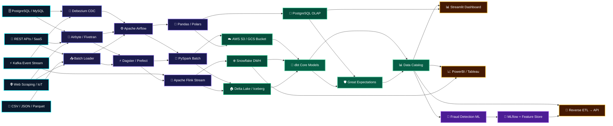

<!-- 1. TOP BANNER -->
<div align="center">
  
  
  <br/><br/>
  
  <h2>👨‍💻 VAN (vn002-tech)</h2>
  <p><b>Data Engineer & MLOps Specialist</b> | Python · PySpark · Apache Airflow · dbt · PostgreSQL</p>
  
  <br/>
  
  <div>
    <a href="https://github.com/vn002-tech"></a>
    <a href="https://linkedin.com/in/YOUR_LINKEDIN"></a>
    <a href="mailto:your_email@gmail.com"></a>
  </div>
  <br/>
  <div>
    
    
    
    
    
    
  </div>
</div>

<br/>

---

<!-- 2. GITHUB STATS -->
<div align="center">
  
</div>

<br/>

<div align="center">
  
  
</div>

<br/><br/>

<!-- 3. ABOUT ME -->
<div align="center">
  
</div>

<br/>

```python
class DataEngineer:
    def __init__(self):
        self.username = "vn002-tech"
        self.role = "Data Engineer & MLOps Specialist"
        self.focus_areas = [
            "Enterprise ETL/ELT Pipeline Orchestration", 
            "Real-Time Stream Processing", 
            "Cloud Data Lakehouse Architecture"
        ]
        self.current_stack = [
            "PySpark", "Apache Airflow", "dbt", 
            "PostgreSQL", "Streamlit"
        ]
        
    def get_mission(self):
        return "Building robust, scalable data pipelines to transform high-volume transactional data into actionable insights."

if __name__ == "__main__":
    engineer = DataEngineer()
    print(engineer.get_mission())
```

<br/><br/>

<!-- 4. TECH STACK -->
<div align="center">
  
</div>

<br/>

<div align="center">
  <h3>Languages & Databases</h3>
  
  <h3>Big Data, ETL & Orchestration</h3>
  
  <p><i>Python · PySpark · Apache Airflow · dbt · Apache Kafka</i></p>
  <h3>Infrastructure & Cloud</h3>
  
</div>

<br/><br/>

<!-- 5. ARCHITECTURE: MESH NETWORK DATA PIPELINE -->
<div align="center">
  
</div>

<br/>



<br/><br/>

<!-- 6. FEATURED PROJECTS -->
<div align="center">
  
</div>

<br/>

| Project | Stack | Description |
| :--- | :--- | :--- |
| 🛡️ **[Bank Fraud Detection System](https://github.com/vn002-tech/Transaksi_bank)** | `Python` `Scikit-Learn` `Streamlit` `PostgreSQL` | ML pipeline & dashboard for transaction fraud detection. |
| ⚡ **[Real-Time Transaction Ingestion](https://github.com/vn002-tech)** | `PySpark` `Kafka` `PostgreSQL` | High-throughput streaming data pipeline for bank logs. |
| ☁️ **[Automated ETL Orchestration](https://github.com/vn002-tech)** | `Airflow` `dbt` `PostgreSQL` | End-to-end automated data transformation & warehousing. |

<br/>

<!-- FOOTER -->
<div align="center">
  
  <br/><br/>
  
</div>
```

Diagram sekarang berbentuk **jaring-jaring (mesh network)** sesungguhnya — setiap source bisa masuk ke multiple ingestion path, setiap processing engine bisa mengirim ke multiple storage, dan setiap output bercabang ke berbagai serving layer! 🕸️🚀
