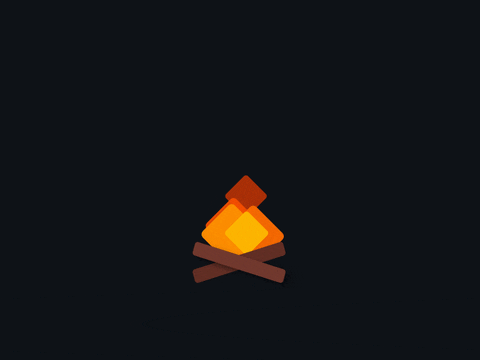

  

<!-- Animated Typing SVG -->

  

<!-- Action & Contact Badges -->

&nbsp;

&nbsp;

  

<!-- 4-Pillar Core AI Engineering Matrix SVG Card -->

---

### 🌐 End-to-End AI Engineering Architecture

  

> **Data Foundation → Feature &amp; Embedding Engine → [ML &amp; Data Science · Deep Learning · LLM &amp; Automation] → FastAPI Serving → Autonomous Client**

---

### 🏎️ Telemetry Velocity &amp; Real-Time System Activity

<!-- Cyber Speedster Racing Across Telemetry Waveform Track -->

  

<!-- Live GitHub Contribution Calendar (Purple Obsidian Theme) -->

  

<!-- All-Time Commits + Private Contributions Enabled -->

&nbsp;&nbsp;

  

<!-- Animated Live Streak Stats -->

  

<!-- Real-time Activity Wave -->

 

<!-- Anime Studio Coding Scene -->

  

<b>“Build systems that turn data into decisions.”</b> 
— VAN · vn002-tech

  

<!-- Animated Wave Footer -->

