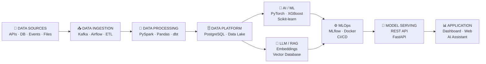

<div align="center">

<!-- ========================================================= -->
<!-- HERO CARD -->
<!-- ========================================================= -->


<br/>


<h1>⚡ VAN <sub>(vn002-tech)</sub></h1>

<h3>AI ENGINEER & MLOps ENGINEER</h3>

<p>
  Building intelligent systems, machine learning pipelines,
  production-ready AI applications, and scalable data platforms.
</p>

<p>
  <code>Python</code>
  <code>PyTorch</code>
  <code>Machine Learning</code>
  <code>LLM</code>
  <code>RAG</code>
  <code>MLOps</code>
</p>

<br/>

<a href="https://github.com/vn002-tech">
  
</a>

<a href="https://linkedin.com/in/YOUR_LINKEDIN">
  
</a>

<a href="mailto:your_email@gmail.com">
  
</a>

<br/><br/>

</div>


<!-- ========================================================= -->
<!-- SPECIALIZATION CARDS -->
<!-- ========================================================= -->

<div align="center">

| 🤖 **AI Engineering** | ⚡ **MLOps** | 📊 **Data Intelligence** | ☁️ **Cloud Native** |
|:---:|:---:|:---:|:---:|
| LLM · RAG · NLP | CI/CD · MLflow | ETL · Analytics | AWS · Docker |
| Model Development | Deployment | Data Pipelines | Kubernetes |

</div>

<br/>


<!-- ========================================================= -->
<!-- GITHUB STATS -->
<!-- ========================================================= -->

<div align="center">

## 📊 GITHUB ACTIVITY

<br/>


<br/><br/>


<br/><br/>


</div>

<br/>


<!-- ========================================================= -->
<!-- ABOUT ME -->
<!-- ========================================================= -->

## 👨‍💻 ABOUT ME

<div align="center">

<table>
<tr>

<td width="50%" valign="top">

### 🤖 AI Engineer

I build intelligent systems that combine
machine learning, data pipelines, APIs,
and production infrastructure.

My focus is not only training models,
but turning models into reliable software
that can actually be deployed and used.

</td>

<td width="50%" valign="top">

### 🎯 Engineering Focus

```text
AI / Machine Learning
        ↓
LLM & RAG Systems
        ↓
Data & Feature Pipelines
        ↓
Model Training
        ↓
MLOps / Deployment
        ↓
Production AI Systems
````

</td>

</tr>
</table>

</div>

<br/>

| 🔑                      | Information                                   |
| :---------------------- | :-------------------------------------------- |
| 👤 **Role**             | AI Engineer & MLOps Engineer                  |
| 🎯 **Primary Focus**    | AI Engineering · Machine Learning · LLM · RAG |
| ⚙️ **Supporting Focus** | Data Engineering · Backend Engineering        |
| 🧠 **AI Stack**         | Python · PyTorch · Scikit-learn · XGBoost     |
| 🧩 **LLM Stack**        | LangChain · RAG · Vector Database             |
| 🔄 **MLOps**            | MLflow · Docker · CI/CD                       |
| 📊 **Data**             | PostgreSQL · PySpark · Kafka · dbt            |
| ☁️ **Infrastructure**   | AWS · Linux · Docker · Kubernetes             |
| 🇮🇩 **Location**       | Indonesia                                     |

<br/>

<!-- ========================================================= -->

<!-- ENGINEERING PHILOSOPHY -->

<!-- ========================================================= -->

<div align="center">

> **"The strongest AI systems are built not only on models,
> but on reliable data, infrastructure, and engineering."**

</div>

<br/>

<!-- ========================================================= -->

<!-- TECH STACK -->

<!-- ========================================================= -->

## 🛠️ TECH STACK

<div align="center">

### 🤖 AI / Machine Learning


<br/><br/>


<br/><br/>

### ⚡ MLOps & AI Infrastructure


<br/><br/>


<br/><br/>

### 📊 Data Engineering


<br/><br/>


<br/><br/>

### ☁️ Cloud & Backend


</div>

<br/>

<!-- ========================================================= -->

<!-- AI SYSTEM ARCHITECTURE -->

<!-- ========================================================= -->

## 🧠 AI ENGINEERING ARCHITECTURE



<br/>

<!-- ========================================================= -->

<!-- AI ENGINEERING PIPELINE -->

<!-- ========================================================= -->

## 🔬 AI ENGINEERING PIPELINE

<div align="center">

```text
┌──────────────────────────────────────────────────────────────┐
│                        DATA SOURCES                          │
│       APIs · PostgreSQL · CSV · Events · External Data       │
└────────────────────────────┬─────────────────────────────────┘
                             │
                             ▼
┌──────────────────────────────────────────────────────────────┐
│                    DATA ENGINEERING                          │
│       ETL · Cleaning · Validation · Feature Engineering      │
└────────────────────────────┬─────────────────────────────────┘
                             │
                             ▼
┌──────────────────────────────────────────────────────────────┐
│                     MODEL DEVELOPMENT                        │
│      Classical ML · Deep Learning · LLM · RAG · NLP          │
└────────────────────────────┬─────────────────────────────────┘
                             │
                             ▼
┌──────────────────────────────────────────────────────────────┐
│                          MLOps                               │
│       Experiment Tracking · Versioning · CI/CD · Docker      │
└────────────────────────────┬─────────────────────────────────┘
                             │
                             ▼
┌──────────────────────────────────────────────────────────────┐
│                       PRODUCTION                             │
│        API · Dashboard · AI Application · Monitoring         │
└──────────────────────────────────────────────────────────────┘

</div>

<br/>


<!-- ========================================================= -->
<!-- FEATURED PROJECTS -->
<!-- ========================================================= -->

## 🚀 FEATURED AI PROJECTS

<div align="center">

<table>

<tr>

<td width="50%" valign="top">

### 🛡️ Fraud Detection AI

Machine learning system for detecting
suspicious financial transactions.

**Stack**

`Python` `XGBoost` `PostgreSQL` `Streamlit`

**Focus**

Machine Learning · Data Pipeline · Prediction

</td>

<td width="50%" valign="top">

### 🧠 RAG AI Assistant

AI assistant using retrieval-augmented
generation to answer domain-specific
questions from external knowledge.

**Stack**

`Python` `LLM` `LangChain` `Vector DB`

**Focus**

LLM · RAG · Semantic Search

</td>

</tr>

<tr>

<td width="50%" valign="top">

### ⚙️ MLOps Pipeline

Production-oriented machine learning
pipeline with experiment tracking,
containerization, and deployment.

**Stack**

`Python` `MLflow` `Docker` `GitHub Actions`

**Focus**

MLOps · CI/CD · Model Lifecycle

</td>

<td width="50%" valign="top">

### 📊 Real-Time AI Analytics

Streaming architecture for processing
high-volume events and preparing data
for real-time intelligence.

**Stack**

`Kafka` `PySpark` `PostgreSQL`

**Focus**

Streaming · Analytics · AI Data Platform

</td>

</tr>

</table>

</div>

<br/>


<!-- ========================================================= -->
<!-- PROJECT LINKS -->
<!-- ========================================================= -->

## 📌 SELECTED PROJECTS

| Project | Technology | Focus |
|:---|:---|:---|
| 🛡️ [Bank Fraud Detection](https://github.com/vn002-tech/Transaksi_bank) | Python · XGBoost · Streamlit | Machine Learning |
| 🏛️ [Government Grant ETL](https://github.com/vn002-tech) | Python · PostgreSQL · ETL | Data Engineering |
| 🏥 [E-Klinik](https://github.com/vn002-tech/E-klinik) | PHP · MySQL · Docker | Backend Engineering |
| 🧠 AI / RAG Projects | Python · LLM · Vector DB | AI Engineering |

<br/>


<!-- ========================================================= -->
<!-- CURRENT LEARNING -->
<!-- ========================================================= -->

## 📚 CURRENTLY EXPLORING

<div align="center">


</div>

<br/>


<!-- ========================================================= -->
<!-- CONTRIBUTION -->
<!-- ========================================================= -->

<div align="center">

## 🌙 CONTRIBUTION

<br/>

<p>
  <i>
    Every commit is another step toward building better systems.
  </i>
</p>

<br/>

<!--
Upload your own animated knight GIF to:

assets/knight-garden.gif

Recommended:
- dark purple fantasy atmosphere
- fallen knight
- sword planted / held
- flower garden
- subtle movement
- cinematic loop
-->


<br/><br/>

### ⚔️

> *"Build systems that remain useful long after the model is trained."*

<br/>


</div>
```

#
