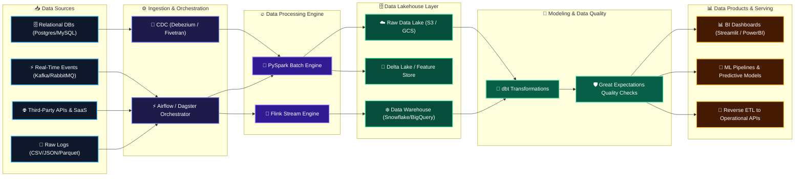

<div align="center">
  
  
  <br/>

  <!-- ANIMASI TYPING TAGLINE BER-EMOJI (FONT: JetBrains Mono) -->
  <a href="https://git.io/typing-svg">
    
  </a>

  <br/><br/>

  <!-- QUICK NAVIGATION BAR (TOMBOL PINTAS) -->
  <a href="#-pipeline_configpy-about-me"></a>
  <a href="#️-end-to-end-enterprise-data-architecture"></a>
  <a href="#️-data-engineering-tech-stack"></a>
  <a href="#-featured-projects"></a>

  <br/><br/>

  <!-- BADGES CONTACT & PLATFORMS -->
  <a href="https://github.com/vn002-tech"></a>
  <a href="https://linkedin.com/in/YOUR_LINKEDIN"></a>
  <a href="mailto:your_email@gmail.com"></a>
  <a href="https://kaggle.com"></a>
</div>

<br/>

---

<!-- SECTION 1: ABOUT ME -->


```python
class DataEngineer:
    def __init__(self):
        self.username = "vn002-tech"
        self.role = "Data Engineer & MLOps Specialist"
        self.focus_areas = [
            "Enterprise ETL/ELT Orchestration", 
            "Real-Time Stream Processing", 
            "Cloud Data Lakehouse Architecture"
        ]
        self.current_stack = [
            "PySpark", "Apache Airflow", "dbt", 
            "PostgreSQL", "Streamlit"
        ]
        
    def get_mission(self):
        return "Building robust, scalable data pipelines to transform high-volume transactional data into actionable insights."

if __name__ == "__main__":
    engineer = DataEngineer()
    print(engineer.get_mission())
```

<br/>

<!-- SECTION 2: EXTENDED ENTERPRISE DATA ARCHITECTURE -->




<br/>

<!-- SECTION 3: TECH STACK -->


<div align="center">
  <h3>Languages & Databases</h3>
  
  
  <h3>Big Data, ETL & Orchestration</h3>
  
  <p><i>Python, PySpark, Apache Airflow, dbt, Apache Kafka</i></p>

  <h3>Infrastructure & Cloud</h3>
  
</div>

<br/>

<!-- SECTION 4: FEATURED PROJECTS -->


| Project | Stack | Description |
| :--- | :--- | :--- |
| 🛡️ **[Bank Fraud Detection & Anomaly System](https://github.com/vn002-tech/Transaksi_bank)** | `Python` `Scikit-Learn` `Streamlit` `PostgreSQL` | Machine Learning pipeline & interactive dashboard for transaction fraud detection. |
| ⚡ **[Real-Time Transaction Ingestion](https://github.com/vn002-tech)** | `PySpark` `Kafka` `PostgreSQL` | High-throughput streaming data pipeline for bank transaction logs. |
| ☁️ **[Automated ETL Orchestration](https://github.com/vn002-tech)** | `Airflow` `dbt` `PostgreSQL` | End-to-end automated data transformation & data warehousing model. |

<br/>

<!-- SECTION 5: GITHUB METRICS -->


<div align="center">
  
  <br/><br/>
  
</div>

<br/>

<!-- FOOTER -->
<div align="center">
  
  <br/>
  <sub><i>"In God we trust, all others must bring data." — W. Edwards Deming</i></sub>
</div>
```
