  

<!-- Animated Typing SVG -->

  

<!-- Action & Contact Badges -->

&nbsp;

&nbsp;

  

<!-- 4-Pillar Core AI Engineering Matrix -->
<table width="100%">
  <thead>
    <tr>
      <th width="25%" align="center">🧠 ML &amp; Data Science</th>
      <th width="25%" align="center">⚡ Deep Learning</th>
      <th width="25%" align="center">🤖 LLMs &amp; Automation</th>
      <th width="25%" align="center">⚙️ MLOps &amp; Systems</th>
    </tr>
  </thead>
  <tbody>
    <tr>
      <td align="center" style="padding: 12px 8px;">
        <b>Predictive &amp; Analytics</b> 
        Feature Pipelines · XGBoost Statistical EDA &amp; Metrics
      </td>
      <td align="center" style="padding: 12px 8px;">
        <b>Neural Systems</b> 
        PyTorch · Tensors Dense Embeddings
      </td>
      <td align="center" style="padding: 12px 8px;">
        <b>AI Automation</b> 
        RAG Pipelines · Vector DBs Autonomous Workflows
      </td>
      <td align="center" style="padding: 12px 8px;">
        <b>Serving &amp; Production</b> 
        FastAPI · Docker Runtime ETL &amp; Data Integrity
      </td>
    </tr>
  </tbody>
</table>

---

### 🌐 End-to-End AI Engineering Architecture

  

> **Data Foundation → Feature &amp; Embedding Engine → [ML &amp; Data Science · Deep Learning · LLM &amp; Automation] → FastAPI Serving → Autonomous Client**

---

### 🛠️ AI Engineering Tech Stack &amp; Tooling

<table width="100%">
  <tr>
    <td width="38%" valign="middle" style="padding: 12px 16px;">
      <b>🧠 Machine Learning &amp; Data Science</b>
    </td>
    <td valign="middle" style="padding: 12px 16px;">
      
      &nbsp;
      
      
      
    </td>
  </tr>
  <tr>
    <td valign="middle" style="padding: 12px 16px;">
      <b>⚡ Deep Learning &amp; Neural Tensors</b>
    </td>
    <td valign="middle" style="padding: 12px 16px;">
      
      &nbsp;
      
      
    </td>
  </tr>
  <tr>
    <td valign="middle" style="padding: 12px 16px;">
      <b>🤖 LLMs, RAG &amp; AI Automation</b>
    </td>
    <td valign="middle" style="padding: 12px 16px;">
      
      
      
    </td>
  </tr>
  <tr>
    <td valign="middle" style="padding: 12px 16px;">
      <b>🔌 Model Serving &amp; AI Applications</b>
    </td>
    <td valign="middle" style="padding: 12px 16px;">
      
      &nbsp;
      
      
    </td>
  </tr>
  <tr>
    <td valign="middle" style="padding: 12px 16px;">
      <b>📊 Data Pipelines &amp; Storage</b>
    </td>
    <td valign="middle" style="padding: 12px 16px;">
      
    </td>
  </tr>
  <tr>
    <td valign="middle" style="padding: 12px 16px;">
      <b>⚙️ MLOps, Containerization &amp; Infrastructure</b>
    </td>
    <td valign="middle" style="padding: 12px 16px;">
      
    </td>
  </tr>
</table>

---

### 📈 GitHub Analytics & Activity

  
  &nbsp;&nbsp;
  
    
  <!-- Animated Live Streak & Activity -->
  
    
  

 

  

<b>“Build systems that turn data into decisions.”</b> 
— VAN · vn002-tech

  

<!-- Animated Wave Footer -->

