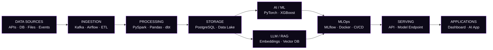

<div align="center">


<br>

### ⚔️ AI ENGINEERING · MLOps · INTELLIGENT SYSTEMS

<p>
  <a href="https://github.com/vn002-tech">GitHub</a>
  ·
  <a href="https://www.linkedin.com/in/YOUR_LINKEDIN/">LinkedIn</a>
  ·
  <a href="mailto:wahidivansaputra@gmail.com">Email</a>
</p>

</div>

---

<div align="center">

<a href="https://github.com/vn002-tech">

</a>
<a href="https://www.linkedin.com/in/YOUR_LINKEDIN/">

</a>
<a href="mailto:wahidivansaputra@gmail.com">

</a>

</div>

## 📊 GitHub Activity

<div align="center">


<br><br>


<br><br>


</div>

## 👨‍💻 About Me

<table>
<tr>
<td width="55%" valign="top">

### AI Engineer

I am an Informatics Engineering graduate focused on building intelligent software systems.

My engineering focus sits at the intersection of **AI/ML, backend systems, data platforms, and MLOps** — from preparing reliable data and training models to exposing models through production-ready services.

</td>
<td width="45%" valign="top">

### Engineering Focus

```text
AI / ML
LLM · RAG · NLP
        ↓
Data & Feature Pipelines
        ↓
Model Training
        ↓
MLOps · Evaluation · CI/CD
        ↓
Production AI Systems
```

</td>
</tr>
</table>

| | |
|:---|:---|
| **Role** | AI Engineer & MLOps Engineer |
| **Primary Focus** | AI Engineering · Machine Learning · LLM · RAG |
| **Supporting Focus** | Data Engineering · Backend Engineering |
| **AI Stack** | Python · PyTorch · Scikit-learn · XGBoost |
| **LLM Stack** | LLM · RAG · LangChain · Vector Search |
| **MLOps** | MLflow · Docker · CI/CD |
| **Data** | PostgreSQL · PySpark · Kafka · dbt |
| **Cloud** | AWS · Linux · Docker · Kubernetes |
| **Location** | Indonesia 🇮🇩 |

> **"Build systems that remain useful long after the model is trained."**

## 🛠️ Tech Stack

<div align="center">

### 🤖 AI / ML


<br>


### ⚡ MLOps / Infrastructure


<br>


### 📊 Data / Backend


<br>


</div>

## 🧠 AI Engineering Architecture



## 🚀 Featured AI Projects

<table>
<tr>
<td width="50%" valign="top">

### 🛡️ Bank Fraud Detection

Machine-learning system for detecting suspicious financial transactions.

`Python` `XGBoost` `PostgreSQL` `Streamlit`

<a href="https://github.com/vn002-tech/Transaksi_bank">View Repository →</a>

</td>
<td width="50%" valign="top">

### 🧠 RAG / AI Assistant

Domain-focused AI assistant architecture using retrieval-augmented generation.

`Python` `LLM` `RAG` `Vector DB`

</td>
</tr>

<tr>
<td width="50%" valign="top">

### ⚙️ MLOps Pipeline

Production-oriented ML lifecycle covering experiments, validation, packaging and deployment.

`Python` `MLflow` `Docker` `GitHub Actions`

</td>
<td width="50%" valign="top">

### 📡 Real-Time AI Analytics

Streaming data architecture designed for high-volume events and real-time intelligence.

`Kafka` `PySpark` `PostgreSQL`

</td>
</tr>
</table>

## 📚 Currently Exploring

<div align="center">

`LLM Engineering` · `RAG Systems` · `AI Agents` · `MLOps` · `Model Evaluation` · `Distributed Systems` · `Cloud AI`

</div>

---

<div align="center">


<br><br>

> **"The strongest AI systems are built not only on models, but on reliable data, infrastructure, and engineering."**

<br>

<sub>VAN · AI Engineer & MLOps Engineer</sub>

</div>
